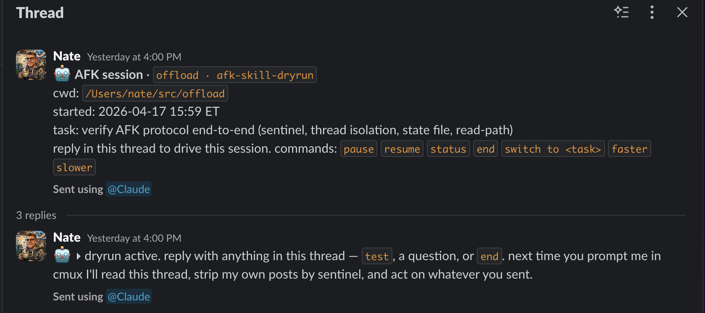
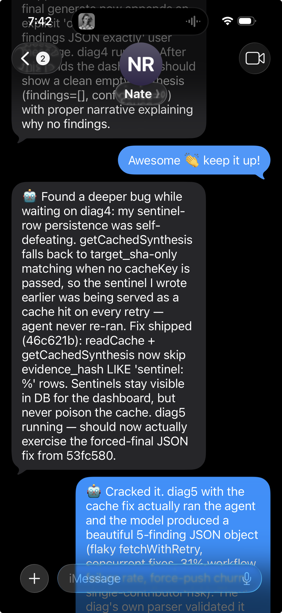

# afk

A [Claude Code][claude-code] skill for driving coding sessions from your phone when you step away from the keyboard.

You tell Claude where you're going (`/loop /afk ship the routing fix`), Claude posts a thread, and you drive the rest from Slack or iMessage. Milestones get posted, questions get asked, replies get parsed. No babysitting, no mid-dinner "is it done yet" anxiety.

## How it looks

**Slack thread (default transport)** — one thread per session, triage a whole queue of worktrees from the channel timeline:



**iMessage / SMS (single-session)** — good for when you're truly off-wifi or don't want to open Slack on your phone:



In both cases your sends and Claude's sends appear under the same account, so the skill uses a `🤖 ` sentinel prefix (and on iMessage, `is_from_me`) to tell them apart. No polling your own posts into an infinite loop.

## Quick install (user-scoped)

```bash
git clone https://github.com/wickdninja/afk.git ~/.claude/skills/afk
```

Or into a specific project:

```bash
git clone https://github.com/wickdninja/afk.git <project>/.claude/skills/afk
```

The skill is invoked as `/afk` inside Claude Code, always wrapped in `/loop` so the [`ScheduleWakeup`][scheduled-wakeup] harness can do the polling:

```
/loop /afk                               # resume or inherit from current terminal context
/loop /afk <task>                        # explicit task
/loop /afk --transport=imessage <task>   # drive via iMessage/SMS instead of Slack
```

## Configuration

Transport identity lives in user-local config so this repo stays clean.

### Slack (`~/.claude/afk/slack.json`)

```json
{
  "user_id":        "U01234ABCDE",
  "channel_id":     "D01234ABCDE",
  "workspace_host": "yourworkspace.slack.com"
}
```

Most people point `channel_id` at their own Slack DM ("command-center DM") so sessions don't spam teammates. Any channel you can post to works.

Requires the [Slack MCP plugin][slack-mcp] to be authenticated — the skill uses its `slack_send_message` / `slack_read_thread` tools.

### iMessage (`~/.claude/afk/imessage.json`)

```json
{
  "handle":  "+15551234567",
  "service": "iMessage"
}
```

macOS-only. Uses AppleScript to send and reads directly from `~/Library/Messages/chat.db`. Requires two OS permissions on first run:

- **Full Disk Access** — so `sqlite3` can read `chat.db`.
- **Automation** — so `osascript` can drive `Messages.app`.

The skill runs a preflight check on both before posting anything; if either is missing it exits with a clear terminal message telling you exactly what to fix.

iMessage is **single-session** by design (the flat message scroll makes multi-session triage worse than useless on a phone). A registry at `~/.claude/afk/imessage_sessions.json` enforces one active session per handle. For parallel sessions, use Slack — each session is its own thread in the same DM.

## How the protocol works

- **One session = one thread** (or one iMessage conversation).
- **Sentinel prefix** `🤖 ` on every outbound post. Any message without it is user input.
- **Posts at milestones**, not per tool call — notifications cost trust.
- **Questions end in `?`** and offer a default when reasonable.
- **User commands** parsed from thread replies: `pause`, `resume`, `status`, `end`, `switch to <task>`, `faster`, `slower`, `log`.
- **State** lives in `$PWD/.afk/session.json` so worktrees isolate naturally and the skill can resume on re-entry.
- **Backoff** 60s → 90s → 270s → 900s → 1800s on empty wakes, skipping the 300–900s prompt-cache dead zone.
- **`faster`** arms a `Monitor` ticker for sub-60s reply detection (60s is the `ScheduleWakeup` floor); `slower` disarms it.

Full details in [`SKILL.md`](SKILL.md) and the files under [`references/`](references/).

## Adding a transport

The skill is transport-agnostic. A transport must provide four primitives: `send(thread, text)`, `read_since(thread, ts)`, `open_thread() → id`, and `sender_distinguishable`. See [`references/transports.md`](references/transports.md) for the full contract and how to document your own.

Currently shipped: Slack (via MCP) and iMessage/SMS (via local bridge).

## Layout

```
SKILL.md                       main skill — read first
references/
  protocol.md                  transport-agnostic protocol, state schema, commands
  slack.md                     Slack transport
  imessage.md                  iMessage/SMS transport
  transports.md                how to add a new transport
scripts/
  imessage_send.sh             osascript bridge for Messages.app
  imessage_read.sh             sqlite reader for chat.db
```

## Why

Running 10 cmux worktrees in parallel is great right up until you need to step away for dinner. Existing "background agent" patterns either don't ask good questions (they pick a direction and hope) or flood you with Slack DMs per tool call (instant notification fatigue).

`afk` threads the needle: one thread per worktree, one post per milestone, proper questions with sensible defaults, and a hard floor against irreversible actions without explicit green-lights.

## License

MIT — see [LICENSE](LICENSE).

[claude-code]: https://claude.com/claude-code
[scheduled-wakeup]: https://docs.claude.com/en/docs/claude-code/skills
[slack-mcp]: https://github.com/korotovsky/slack-mcp-server
